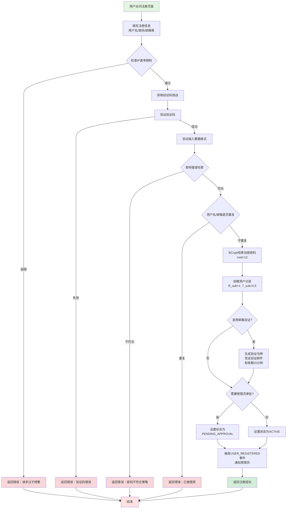

**关键步骤说明：**

1. **速率限制检查**：防止批量注册攻击，每IP每小时最多5次
2. **验证码验证**：支持数学验证码和hCaptcha两种方式
3. **密码策略**：至少8位，含大小写字母、数字和特殊符号
4. **用户名规则**：3-20字符，仅限字母数字下划线
5. **初始权限**：默认角色Junior（R_sub=1），信任值0.5（T_sub=0.5）
6. **邮箱验证**：验证令牌有效期15分钟，通过URL链接验证

---

### 1.2 用户登录流程

**功能描述：** 用户身份认证，支持用户名密码登录和双因素认证

**流程图：**

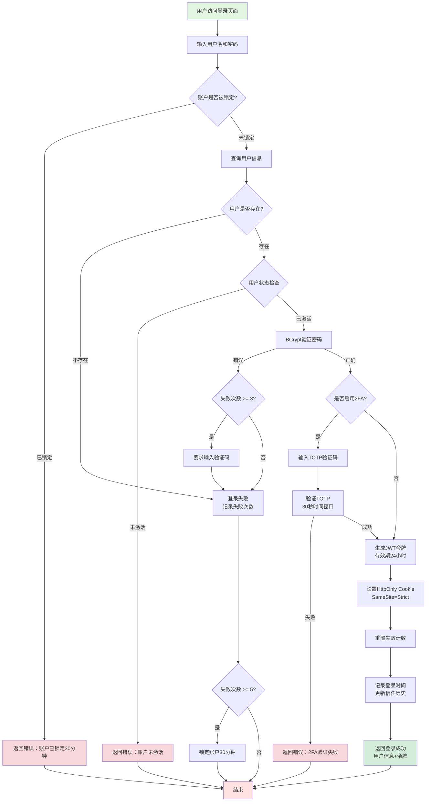
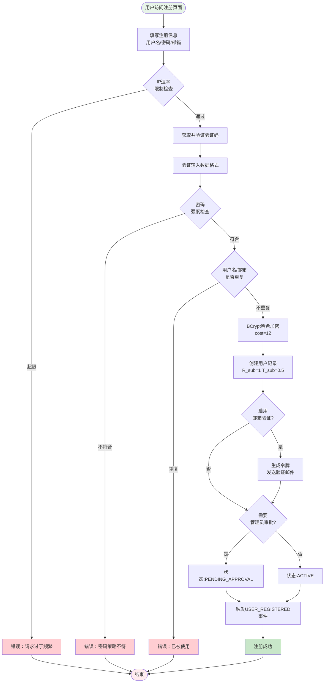

**流程步骤说明：**

1. **用户输入**：填写用户名、密码、显示名称、邮箱等信息
2. **速率限制**：每IP每小时最多5次注册请求，防止批量注册攻击
3. **验证码验证**：支持数学验证码和hCaptcha两种方式
4. **格式验证**：
   - 用户名：3-20字符，仅字母数字下划线
   - 邮箱：标准邮箱格式
   - 密码：至少8位，包含大小写字母、数字和特殊符号
5. **重复检查**：确保用户名和邮箱唯一性
6. **密码加密**：使用BCrypt算法，cost因子为12
7. **初始化用户**：默认角色Junior（R_sub=1），初始信任值0.5（T_sub=0.5）
8. **邮箱验证**：生成15分钟有效期的验证令牌，通过邮件发送验证链接
9. **状态设置**：根据配置决定是否需要管理员审批
10. **事件通知**：触发USER_REGISTERED实时事件，通知管理员

---

### 1.2 用户登录流程

**功能描述：** 提供用户身份认证服务，支持双因素认证和自适应验证码

**涉及模块：** AuthController, UserService, TotpService, SessionManager

**主要特性：**
- BCrypt密码验证
- 自适应CAPTCHA（3次失败后强制要求）
- TOTP双因素认证
- 账户锁定（5次失败锁定30分钟）
- JWT令牌签发（24小时有效期）

**流程图：**

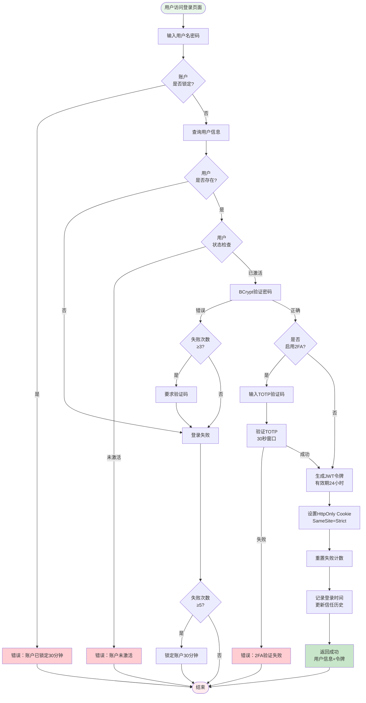

**流程步骤说明：**

1. **账户锁定检查**：检查是否因多次失败被锁定（5次失败锁定30分钟）
2. **用户查询**：从数据库获取用户信息
3. **状态检查**：验证用户账户是否已激活（邮箱验证或管理员审批）
4. **密码验证**：使用BCrypt比较哈希值
5. **自适应验证码**：失败3次后强制要求验证码验证
6. **2FA验证**：如用户启用TOTP双因素认证，需输入6位验证码
7. **令牌签发**：生成JWT令牌，包含用户ID、角色、信任值等信息
8. **Cookie设置**：设置HttpOnly和SameSite=Strict的安全Cookie
9. **信任记录**：记录登录时间，作为信任演化的依据

---

### 1.3 双因素认证(2FA)设置流程

**功能描述：** 为用户账户添加TOTP双因素认证保护

**涉及模块：** AuthController, TotpService

**主要特性：**
- 基于HMAC-SHA1的TOTP算法
- 30秒时间窗口
- 生成QR码供认证器扫描
- 需验证首个验证码后才启用

**流程图：**

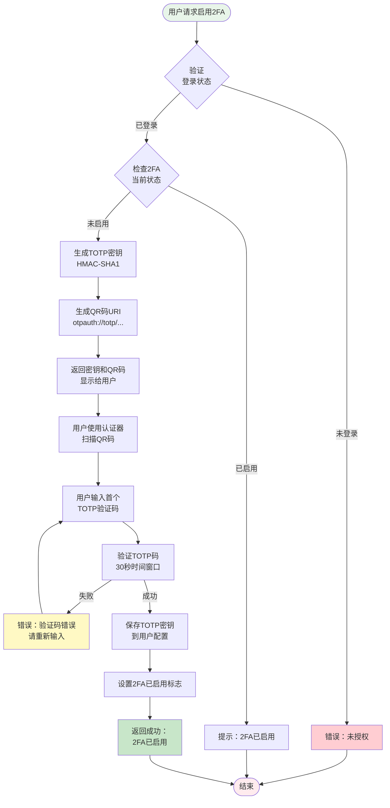

**流程步骤说明：**

1. **身份验证**：确认用户已登录且持有有效令牌
2. **状态检查**：避免重复设置
3. **密钥生成**：使用加密安全的随机数生成器创建TOTP密钥
4. **QR码生成**：格式为`otpauth://totp/CAAC:username?secret=...&issuer=CAAC`
5. **用户扫描**：使用Google Authenticator、Authy等认证器应用扫描
6. **验证确认**：要求用户输入首个验证码，确保密钥正确保存
7. **启用标志**：设置用户的has2FA字段为true，后续登录需验证

---

## 二、文件访问控制功能

### 2.1 上下文感知访问决策流程

**功能描述：** 系统核心功能，基于多维上下文评分动态决定是否允许访问

**涉及模块：** FileAccessController, ContextResolverService, OracleClient, CAACContract (链码)

**主要特性：**
- 17维参数上下文感知决策（Algorithm 1）
- 对象风险评估（新颖度、大小、年龄）
- HMAC签名防篡改
- 区块链不可篡改决策记录
- 风险预算检查
- 集群风险传播（CSRP）
- 会话注册与监控

**流程图：**

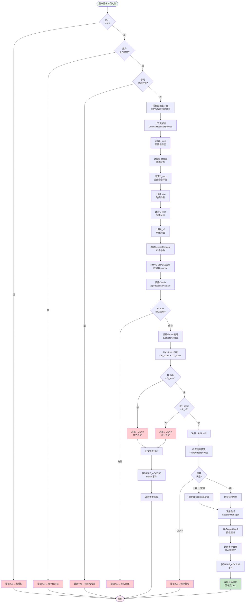

**上下文感知决策详细步骤：**

1. **身份认证**：验证JWT令牌有效性
2. **封禁检查**：检查用户是否因异常行为被封禁
3. **CSRP检查**：检查用户所在子网是否因集群风险被封锁
4. **原始上下文采集**：网络类型、设备信息、IP地址、访问时间
5. **上下文解析**：将原始上下文映射为数学评分
6. **对象风险计算**：新颖度、大小因子、年龄因子
7. **有效阈值调整**：P_eff = P_req + O_risk
8. **HMAC签名**：防止请求被篡改
9. **Oracle验证**：验证签名和时间窗口
10. **Algorithm 1执行**：计算CE_score和DT_score
11. **双重判断**：角色权限 + 信任评分
12. **风险预算检查**：防止数据过度泄露

---

### 2.2 文件流式传输流程

**功能描述：** 实现分块窗口预算控制的安全文件传输

**涉及模块：** FileAccessController, SessionManager, IpfsService

**主要特性：**
- BV-GCA窗口预算算法
- 分块传输（8KB）
- 窗口耗尽时重新评估
- 自动撤销机制

**流程图：**

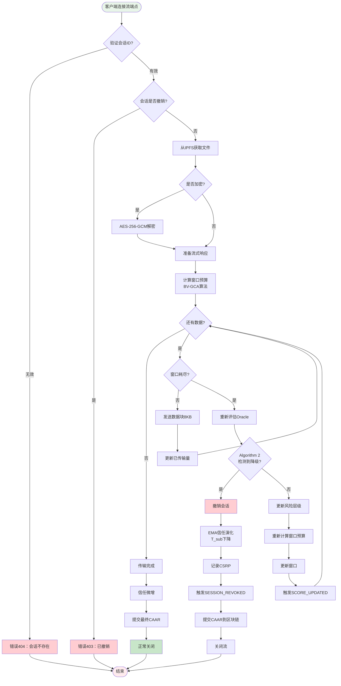

---

### 2.3 持续撤销检测流程 (Algorithm 2)

**功能描述：** 后台定时任务，持续监控所有活跃会话的上下文变化

**涉及模块：** RevocationScheduler, SessionManager, ContextResolverService

**流程图：**

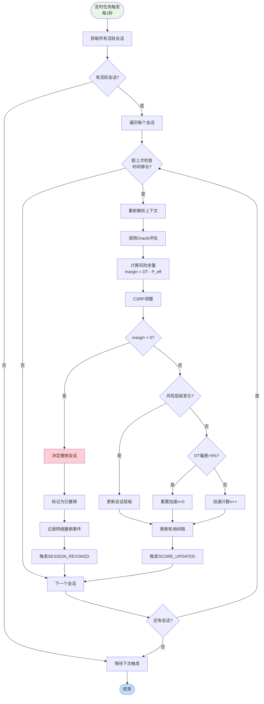

---

## 三、文件管理功能

### 3.1 文件上传流程

**功能描述：** 将文件加密上传到IPFS分布式存储

**涉及模块：** FileAccessController, IpfsService, FileRegistry

**流程图：**

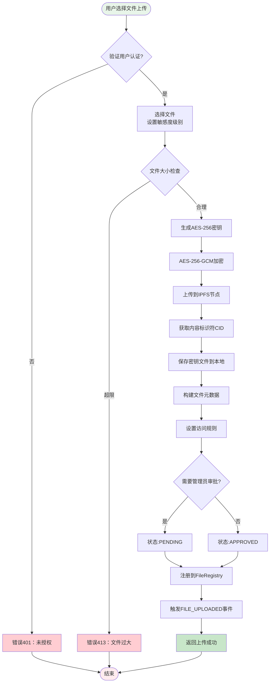

### 3.2 文件审批流程

**功能描述：** 管理员审批待审核文件

**流程图：**

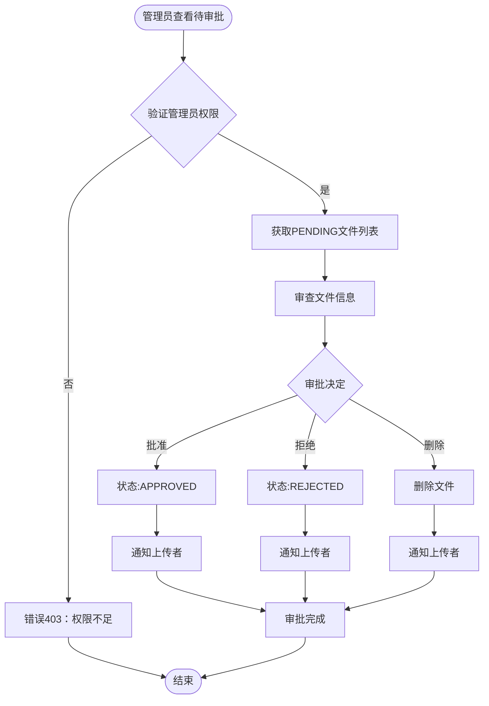

---

## 四、风险管理功能

### 4.1 风险预算检查流程

**功能描述：** BV-GCA算法风险预算管理

**流程图：**

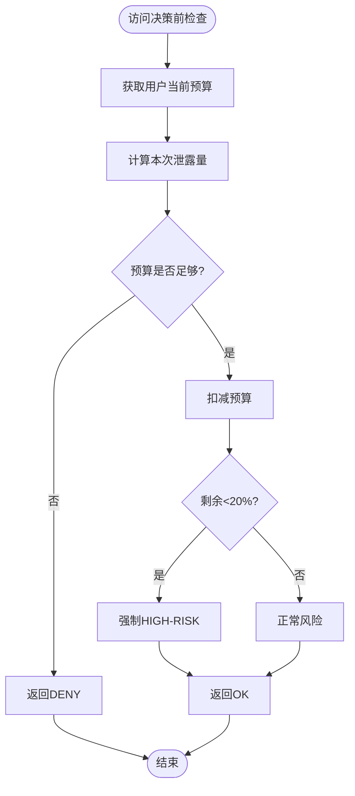

---

### 4.2 集群风险传播流程 (CSRP)

**流程图：**

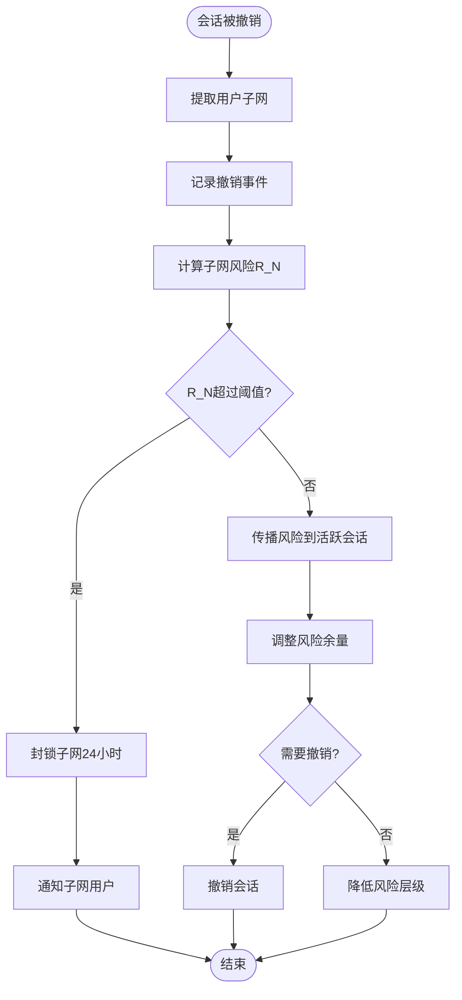

---

### 4.3 异常行为检测流程

**流程图：**

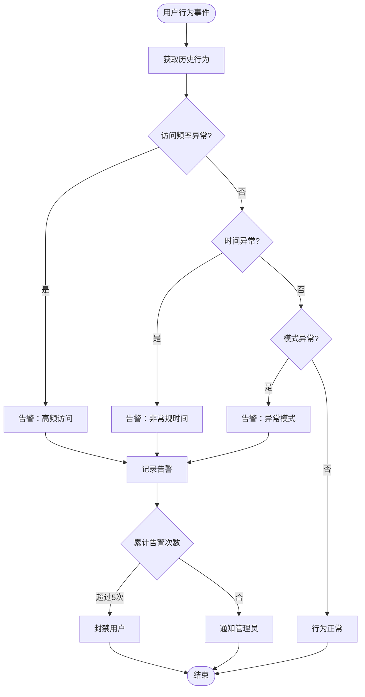

---

## 五、实时监控与审计功能

### 5.1 实时事件推送流程 (SSE)

**流程图：**

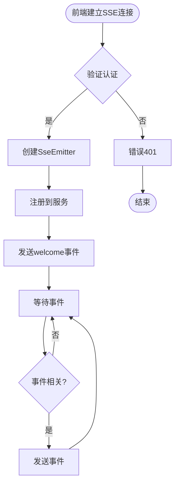

---

### 5.2 审计日志记录流程

**流程图：**

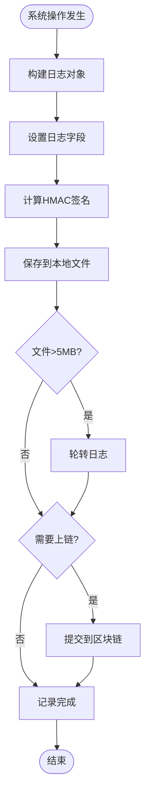

---

## 附录：图例说明

**节点颜色**：
- 浅绿色：开始
- 深绿色：成功结束
- 浅红色：异常结束
- 红色：错误
- 黄色：警告
- 浅蓝色：后台任务

**文档版本**：V1.0  
**生成日期**：2026-06-18  
**维护者**：FlexiGuard CAAC项目组

---

**说明**：本文档包含系统所有主要功能的Mermaid流程图，可使用支持Mermaid的工具查看或导出为图片。

